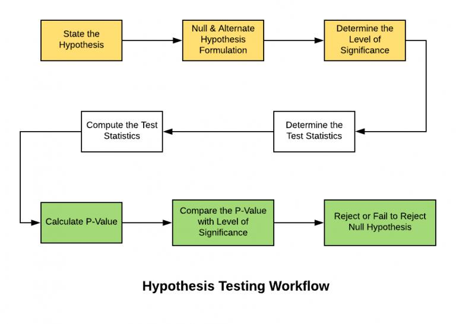
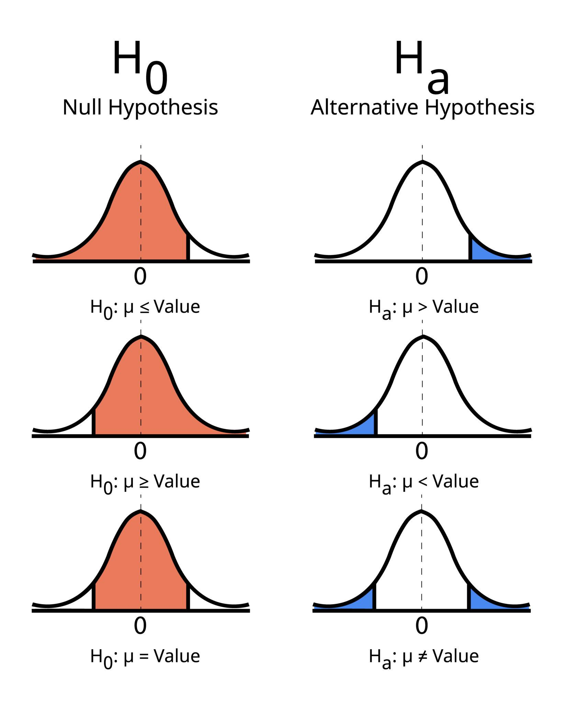
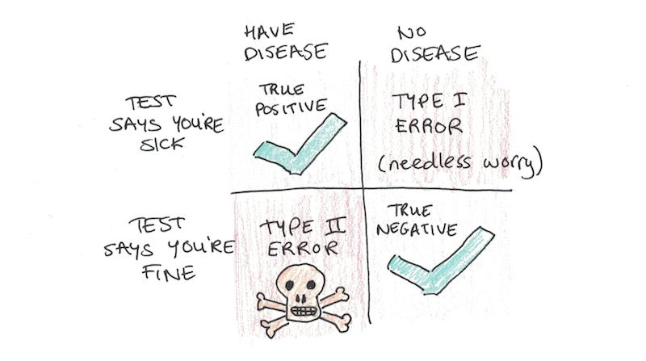

# 📊 Day 1 — A/B Testing

## 🚀 Overview
A/B Testing is a statistical method used to compare two versions (Control vs Treatment) to determine which performs better.

---

## 🎯 Objective
Understand how to make data-driven decisions using hypothesis testing.

---

## 🔹 Key Concepts

### Control vs Treatment
- Control → Current version (baseline)  
- Treatment → New variation  

### Hypothesis
- Null Hypothesis (H₀) → No change  
- Alternate Hypothesis (H₁) → Improvement exists  

---

## 🔹 A/B Testing Process

1. Define Hypothesis  
2. Check Assumptions  
3. Collect Data  
4. Calculate CTR  
5. Perform Statistical Test  
6. Draw Conclusion  

---

## 🔹 CTR Formula

CTR = Clicks / Impressions  

Used to compare performance between groups.

---

## 🔹 Statistical Testing

- Z-test for proportions  
- Used to check if the difference is statistically significant  

---

## 🔹 Hypothesis Visualization

---

## 🔹 Key Metrics

### p-value
- If p < 0.05 → Reject H₀  
- Indicates statistical significance  

### Z-score
- Measures deviation from mean  

---

## 🔹 Errors & Statistical Concepts

- Type I Error → False Positive  
- Type II Error → False Negative  

---

## 🔹 Statistical Power
- Probability of detecting a real effect  

---

## 📂 Files in This Folder

- ab_testing.ipynb → Implementation  
- notes.pdf → Theory notes  
- visuals/ → Infographics  

---

## 📌 Key Takeaway

A/B testing is not just comparing numbers.  
It is about validating decisions using statistical evidence.
